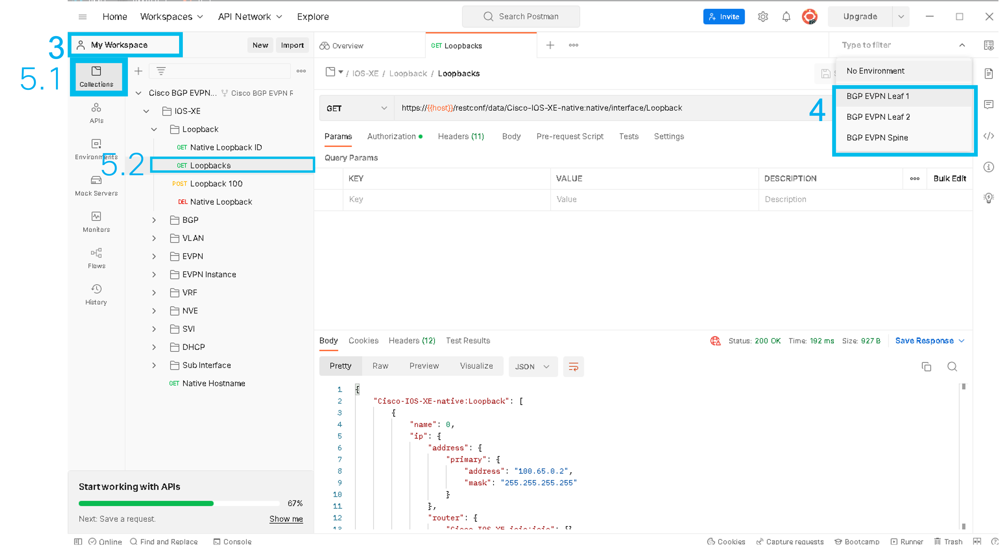
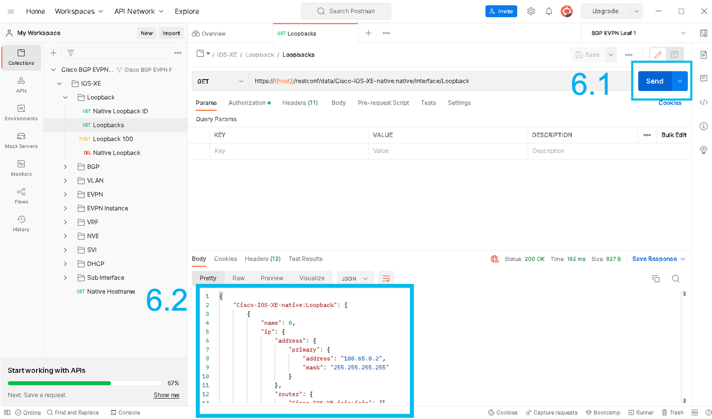

## Postman Module
Use Postman to work with the RESTCONF API and easily manage Catalyst devices. In this example, work with BGP EVPN setup to understand the current environment and send a payload to the Catalyst device using Postman.

Note: For this portion of the lab, we will move to a dCloud environment rather than the pods we’ve been working in for the previous Tasks. See your lab admin 

1. Open the Postman desktop app
1. Ensure that you are logged in. If not, you can ask a lab admin for credentials or create a new Postman account
1. Choose "My Workspace"
1. Select an Environment from the dropdown: Leaf 1, Leaf 2 or Spine, which has the IP and credentials set for each respective device
1. In "Collections," select the desired REST API call from the dropdowns such as "Loopbacks" with the "GET" operation

1. Click the blue "Send" button and see the response

1. After sending the payload, the device will return the current loopbacks on the device. 

Congrats! You've completed this section! If time permits, explore the other various folders and 