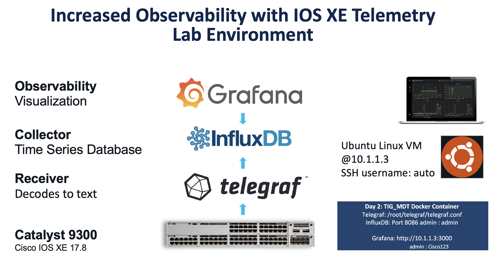
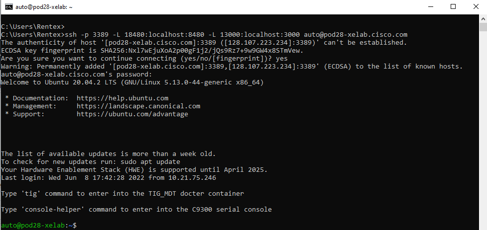
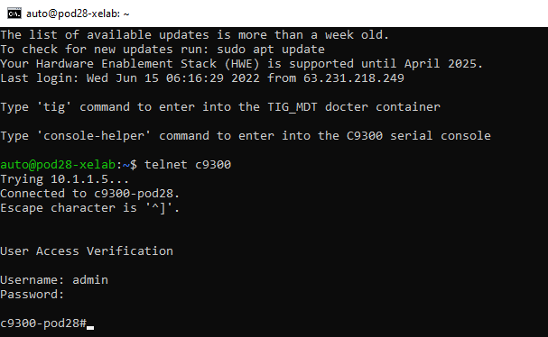
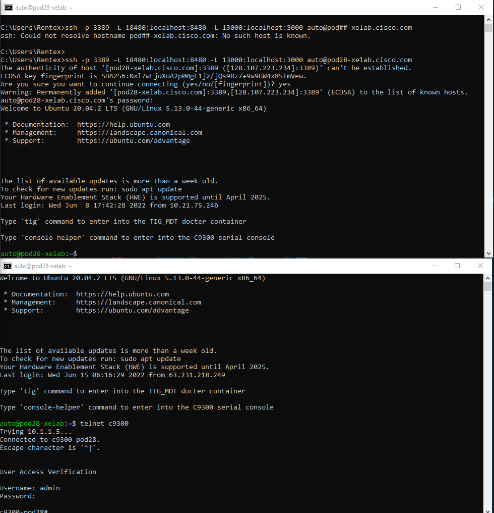

# Welcome to the Cisco Live 22 IOS XE Programmablity Lab

### This lab guide serves as the Cisco Live US (Las Vegas) Programmability and Automation Lab with Catalyst IOS XE Platforms session LTROPS-1836

# Lab Introduction
To access the lab, you will need to SSH to the VM specific host. From the VM host you will have access to the switch and the remaining software dependencies for the lab. Please find below the actual lab environment and instructions. 


# Lab environment



# Accessing the lab environment 

1. Identify your pod#.
 
2. Open two terminal windows and SSH to both. One window will be used to configure the VM. The second window is for telnet access into the C9300.

3. To SSH into the devices, copy/paste the below line into each of the terminal sessions. Replace the ## symbol on the SSH command with your pod number. Use the password given to you by the facilitator.

```ssh -p 3389 -L 18480:localhost:8480 -L 13000:localhost:3000 auto@pod##-xelab.cisco.com```

Once you logged into the VM, the first time you login, you'll see this question:

`Are you sure you want to continue connecting (yes/no/[fingerprint])?` 

Type, `yes` to continue 

After you approve the entry you should be able to see the following prompt:




4. Telnet into the Catalyst 9300 into the second window that you opened before. Use the following credentials: admin / Cisco123



5. Once you finished accesing via SSH and telnet into the VM and the switch respectively, this is how you should see them:



# Lab Modules

Lab modules can be completed in any order. Mark the lab completed in the [SmartSheet](https://app.smartsheet.com/b/form/134240eac2d84a57acd4efc24fd8f3d0) form once you have successfully completed each module. 

## [gNOI reset.proto and ZTP Module](gNOI_reset_proto.md)
Reset.proto also known as the Factory Reset API is the latest addition to the gNOI operations interface within the gNMI. 

The factory reset API as described at [openconfig/gnoi](https://github.com/openconfig/gnoi/blob/master/factory_reset/) with tooling from [google/gnxi](https://github.com/google/gnxi/tree/master/gnoi_reset).

Use the NETCONF API with Guest Shell to create the base configurations for a switch to [implement Zero Touch Provisioning](ZTP.md).


## [YANG Suite Module](YANG_Suite.md)
[YANG Suite](https://github.com/CiscoDevNet/yangsuite) is HTML5 based tooling that is available for working with the YANG based programmable interfaces on Cisco IOS XE, XR, and NX Network Operating Systems. It has plugins that allow for interacting with the programmable interfaces and supports downloading YANG files directly from network devices. In this module, we will explore using NETCONF and RESTCONF to configure a switch and we will create a gRPC telemetry subscriptions.


## [Secure Streaming Telemetry Module](https://github.com/guaguila/CLive2022_DEVWKS-3240)
Model-driven Telemetry (MDT) provides a mechanism to stream data from an MDT-capable device to a destination. It uses a new approach for network monitoring in which data is streamed from network devices continuously using a push model and provides near real-time access to operational statistics for monitoring data. Applications can subscribe to specific data items they need, by using standards-based YANG data models over open protocols. Structured data is published at a defined cadence or on-change, based upon the subscription criteria and data type.

**Dial-out** telmetry subscriptions need to be statically configured on the network device using any of the available interfaces (CLI, APIs, etc.) and the device will open a session with the application. If the session goes down, the device will try to open a new session. gRPC is the Dial-Out telemetry interface. 

Additionally, we can set up a secure telmetry subscriptions by using mutual TLS (mTLS) and adding certificates using the gNOI_cert operation, which will create a new certificate and apply it to the IOS XE device.


## [Terraform Module](Terraform.md)
Terraform is an Infrastructure as Code (IaC) tooling that allows network operators to easily view operational data, configure devices and manage network resources​. Since Terraform is cloud native, it works well with Cisco IOS XE cloud native solutions for routing, switching, and wireless platforms including the Cisco Catalyst 9000 Family switches, the Cisco Catalyst 8000V (virtual) router and the Cisco Wireless LAN Controller (WLC) 9800-CL (CL stands for “Cloud”). As well as easily managing cloud-native solutions, Terraform can also configure campus solutions. With Cisco IOS XE, we can automate with any tooling on any interface.

Terraform is declarative, meaning that it defines the desired state. It has commercial support from HashiCorp.

IOS XE Terraform utilizes RESTCONF + YANG to configure devices using a single binary file. To build out the RESTCONF payload, we can use the CLI2YANG feature. In Cisco IOS XE Cupertino 17.7.1 and later releases, you can automatically translate IOS commands into relevant NETCONF-YANG XML or RESTCONF-JSON request messages. You can analyze the generated configuration messages and familiarize with the Xpaths used in these messages. The generated configuration in the structured format can be used to provision other devices in the network; however, this configuration cannot be modified.

In this module, we will use CLI2YANG to create a Terraform payload to configure a 9300 device.


# Feedback
 Mark the lab completed and provide any feedback and comments in the [SmartSheet](https://app.smartsheet.com/b/form/3c15e982ec7c40a089ccfdeb375776e0) form once you have successfully completed the modules above. 
