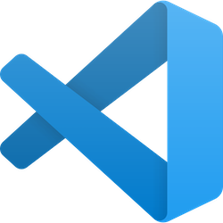
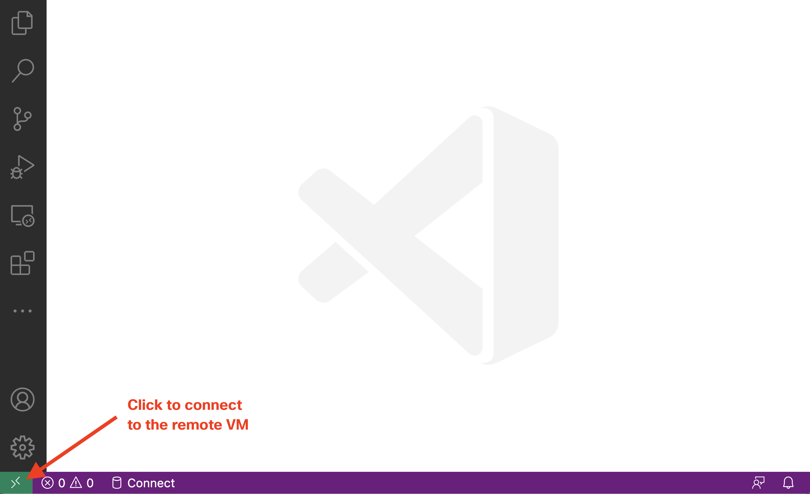
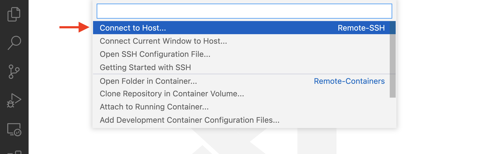
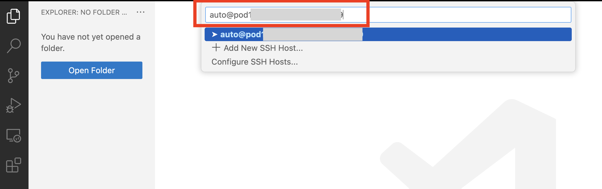
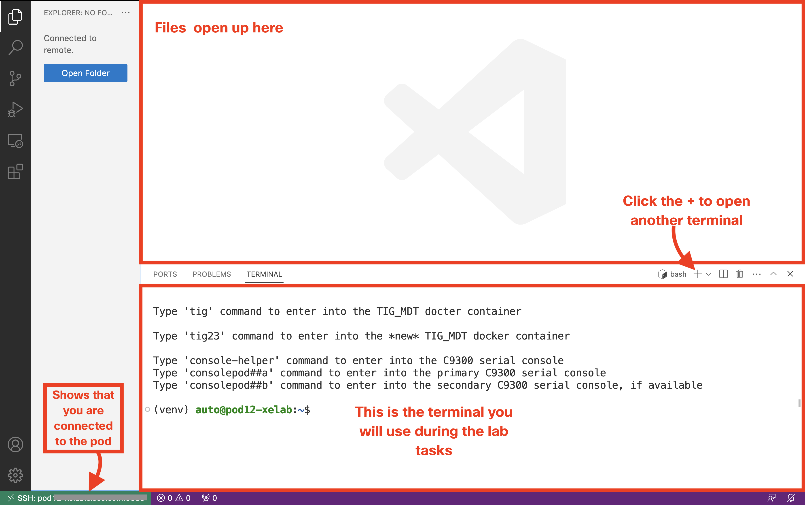

# Welcome to the Cisco Live 23 IOS XE Programmablity Lab

## Version 17.11

### This lab guide serves as the Cisco Live US (Las Vegas) Programmability and Automation Lab with Catalyst IOS XE Platforms session LTROPS-1836

# Lab Introduction
To access the lab, you will need to SSH to the VM specific host. From the VM host you will have access to the switch and the remaining software dependencies for the lab. Please find below the actual lab environment and instructions. 

# Lab environment

# Accessing the lab environment 

# New Lab Access
# 0. Connect to the lab environment

During the Cisco Live event, each participant receives their own hardware Pod. Each pod includes a Linux development host, YANG Suite, a running NetBox instance, and a ticket system.

## Connect to your environment using Visual Studio Code remote SSH extension

> **Note**: Instructor will provide you with your Pod number and credentials.

**STEPS:**

<table>

<tr><th>Step</th><th width=50%>Description</th><th>Screenshot / code snippet</th></tr>

<tr><td>1.</td><td>

Open the Microsoft Visual Studio Code application from your desktop.

</td><td>

</td></tr>

<tr><td>2.</td><td>

To connect to your Linux Developer VM, click the green icon on the left bottom of Visual Studio Code application.

</td><td>

</td></tr>

<tr><td>3.</td><td>

Select `Connect to Host...`.

</td><td>

</td></tr>
<tr><td>4.</td><td>
    
Fill in the connection details to your Pod's Developer VM: `auto@pod<xx>-xelab.cisco.com:3389` where `<xx>` should be replaced with a two digit number of your pod. For example Pod 50 would be `auto@pod50-xelab.cisco.com:3389`.

> **Note**: If your pod number is one digit, add a zero in front, for example Pod 1 number would be `01`.

> **Note**: If you are prompted to select the platform of the remote host, click `Linux`.

</td><td>

</td></tr>
<tr><td>5.</td><td>

If prompted to verify the Fingerprint, click `Continue`.

</td></tr>
<tr><td>6.</td><td>

Fill in the password that the instructor has provided you.

</td></tr>
<tr><td>7.</td><td>

After a short period of loading, Visual Studio code view will update to match the settings on the developer VM. Note how the terminal view on the bottom right now starts with the `(venv) auto@podXY-xelab:~$` - this is the Developer VM on which you will complete the Lab tasks. Note also that you can see on the bottom right the Pod URL to which you are connected to.

> **Note**: If the terminal view does not show up automatically, you can open it from the top menu of Visual Studio Code application: `Terminal` > `New terminal`
</td><td>

</td></tr>
</table>

# Lab Modules

Lab modules can be completed in any order. Mark the lab completed in the [SmartSheet](https://app.smartsheet.com/b/form/134240eac2d84a57acd4efc24fd8f3d0) form once you have successfully completed each module. 

## [gNOI reset.proto and ZTP Module](gNOI_reset_proto.md)
Reset.proto also known as the Factory Reset API is the latest addition to the gNOI operations interface within the gNMI. 

The factory reset API as described at [openconfig/gnoi](https://github.com/openconfig/gnoi/blob/master/factory_reset/) with tooling from [google/gnxi](https://github.com/google/gnxi/tree/master/gnoi_reset).

Use the NETCONF API with Guest Shell to create the base configurations for a switch to [implement Zero Touch Provisioning](ZTP.md).

## [gRPC Tunnel](./gRPCTunnel.md)
“grpctunnel is an implementation of a TCP-over-gRPC tunnel”
It is very similar to the commonly used “SSH tunnel” concept. Learn more at https://github.com/openconfig/grpctunnel. The benefits of gRPC Tunnle include:
- The devices makes a secure outbound connection to the gRPC tunnel server in order to expose the gNMI API for operational use
- Many devices can connect into a single tunnel server in order to increase operational efficiency
- Tunnels can be opened to any number of servers as needed and is not limited to a single tunnel

## [YANG Suite Module](YANG_Suite.md)
[YANG Suite](https://github.com/CiscoDevNet/yangsuite) is HTML5 based tooling that is available for working with the YANG based programmable interfaces on Cisco IOS XE, XR, and NX Network Operating Systems. It has plugins that allow for interacting with the programmable interfaces and supports downloading YANG files directly from network devices. In this module, we will explore using NETCONF and RESTCONF to configure a switch and we will create a gRPC telemetry subscriptions.

## [Postman Module](Postman.md)
[Postman](https://www.postman.com) is a common tool used for testing REST APIs. Taking it a step further, we can use Postman to test Cisco IOS XE REST APIs, namely RESTCONF to configure, manage, and monitor data from these Cisco devices. Cisco has published various Postman collections to make it easier to use Recently, Cisco has publicly released a new BPG EVPN collection for easy configuration management. 

## [Terraform Module](Terraform.md)
Terraform is an Infrastructure as Code (IaC) tooling that allows network operators to easily view operational data, configure devices and manage network resources​. Since Terraform is cloud native, it works well with Cisco IOS XE cloud native solutions for routing, switching, and wireless platforms including the Cisco Catalyst 9000 Family switches, the Cisco Catalyst 8000V (virtual) router and the Cisco Wireless LAN Controller (WLC) 9800-CL (CL stands for “Cloud”). As well as easily managing cloud-native solutions, Terraform can also configure campus solutions. With Cisco IOS XE, we can automate with any tooling on any interface.

Terraform is declarative, meaning that it defines the desired state. It has commercial support from HashiCorp.

IOS XE Terraform utilizes RESTCONF + YANG to configure devices using a single binary file. To build out the RESTCONF payload, we can use the CLI2YANG feature. In Cisco IOS XE Cupertino 17.7.1 and later releases, you can automatically translate IOS commands into relevant NETCONF-YANG XML or RESTCONF-JSON request messages. You can analyze the generated configuration messages and familiarize with the Xpaths used in these messages. The generated configuration in the structured format can be used to provision other devices in the network; however, this configuration cannot be modified.

In this module, we will use CLI2YANG to create a Terraform payload to configure a 9300 device.

# Feedback
 Mark the lab completed and provide any feedback and comments in the [SmartSheet](https://app.smartsheet.com/b/form/3c15e982ec7c40a089ccfdeb375776e0) form once you have successfully completed the modules above. 

