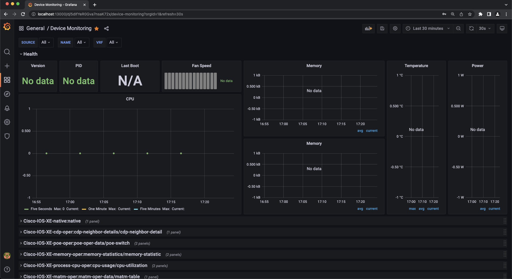

# Configuring Telemetry Subscriptions on the Catalyst 9300
This section focuses on the configuration of a Catalyst 9300 switch and a Ubuntu VM machine that has the necessary software dependencies to reproduce the MDT contents reviewed during the presentation. This consists of several configuration steps:

1. Every process that you need to monitor from the device requires a subscription. We will create four subscriptions to monitor the following aspects: CPU, Power, Memory and Temperature.

1. In our case, the type of encoding is: ‘encode-kvgpb’

1. YANG Push can be used to monitor configuration or operational datastore changes. We will use: ‘stream yang-push’ 

1. Define the update interval periodicity: tells how frequently we want to send the traffic (in milliseconds) to the receiver of the traffic '6000'.

1. Specify the receiver of the traffic, in this case is the switch: 10.1.1.5. 

1. Copy & paste or enter the following commands, exactly as they appear on the Catalyst 9300:


```
configure terminal
telemetry ietf subscription 1010
encoding encode-kvgpb
filter xpath /process-cpu-ios-xe-oper:cpu-usage/cpu-utilization/five-seconds
source-address 10.1.1.5
stream yang-push
update-policy periodic 6000
receiver ip address 10.1.1.3 57500 protocol grpc-tcp

telemetry ietf subscription 1020
encoding encode-kvgpb 
filter xpath /poe-ios-xe-oper:poe-oper-data
source-address 10.1.1.5
stream yang-push
update-policy periodic 6000
receiver ip address 10.1.1.3 57500 protocol grpc-tcp

telemetry ietf subscription 1030
encoding encode-kvgpb
filter xpath /memory-ios-xe-oper:memory-statistics/memory-statistic
source-address 10.1.1.5
stream yang-push
update-policy periodic 6000
receiver ip address 10.1.1.3 57500 protocol grpc-tcp
 
telemetry ietf subscription 1040
encoding encode-kvgpb
filter xpath /oc-platform:components/component/state/temperature
source-address 10.1.1.5
stream yang-push
update-policy periodic 6000
receiver ip address 10.1.1.3 57500 protocol grpc-tcp
```

 
 
 # Increased Observability with IOS XE Telemetry displayed in Grafana

Grafana is an open source solution for running data analytics, it pulls up selective metrics out of the huge amount of data that we are ingesting daily from our devices and apps with the help of customizable dashboards.

Grafana connects with every possible data source or databases such as Graphite, Prometheus, Influx DB, ElasticSearch, MySQL, PostgreSQL etc. In this case we will extract the information from the subscriptions that were created before on the switch. This data has been sent from the switch to Influx DB. Now, we will pass this data into Grafana for visualization.

Grafana being an open source solution also enables us to write plugins from scratch for integration with several different data sources.

## Open the following browser URL to access the Grafana dashboard 
```http://localhost:13000/```

Username: admin

Password: Cisco123


Before adding in the subscriptions, to the 9300, the dashboard will be very bare.



Once adding the configurations above. The CPU Utilization streaming telemetry data, the average and current memory consumption patterns, the temperature levels (max, min, avg) and power readings that were configured earlier are now visible in the pre-configured charts. 

If data is not streaming in to Grafana, try changing the time range in the top right corner.


The data should be streaming in and appearing on the Grafana dashboard.