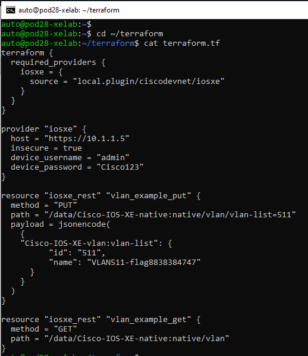
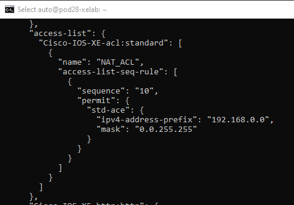

# Terraform

[Terraform](https://www.terraform.io) is a cloud native, open-source infrastructure provisioning tooling similar to Ansible. IOS XE Terraform utilizes RESTCONF + YANG to configure devices using a single binary file. Terraform is declarative, meaning that it defines the desired state. It has commercial support from HashiCorp.

Terraform providers communicate with the desired resource. Typically, there are one or more resources in a .tf file.

Terraform is installed using the “apt” package management system. Running the Debian Package command, or dpkg, with the -L flag (list) shows which packages are installed on the system, including the Terraform tool.

1. We'll use the JSON in a Terraform file to configure a new VLAN on a Catalyst 9300.
1. Navigate to the terraform directory `cd ~/terraform` within the Linux VM
1. Review the terraform.tf file to apply a new VLAN to the switch using the command `cat terraform.tf`, which will look similar to the following:


### terraform.tf
```
terraform {
  required_providers {
    iosxe = {
      source = "CiscoDevnNet/iosxe"
    }
  }
}

provider "iosxe" {
  host = "https://10.1.1.5"
  insecure = true
  device_username = "admin"
  device_password = "Cisco123"
}

resource "iosxe_rest" "vlan_example_put" {
  method = "PUT"
  path = "/data/Cisco-IOS-XE-native:native/vlan/vlan-list=511"
  payload = c(
    {
    "Cisco-IOS-XE-vlan:vlan-list": {
          "id": "511",
          "name": "VLAN511-flag8838384747"
      }
    }
  )
}

resource "iosxe_rest" "vlan_example_get" {
  method = "GET"
  path = "/data/Cisco-IOS-XE-native:native/vlan"
}
```




## Apply Terraform
Now that the .tf file has been reviewed and is ready for use, the Terraform tool itself can be initialized and then used to apply this configuration


1. In the terminal window where you are SSH'd into the Ubuntu host, initialize Terraform with the command `terraform init`
1. Apply the configuration with the terraform apply command `terraform apply -auto-approve`


1. Note that the terraform provider has been executed if the message appears "Apply complete! Resources: 2 added, 0 changed, 0 destoyed."


Next, let's create a new Terraform file in a new directory using the CLI2YANG feature described below.

## CLI2YANG
In Cisco IOS XE Cupertino 17.7.1 and later releases, you can automatically translate IOS commands into relevant NETCONF-YANG XML or RESTCONF-JSON request messages. You can analyze the generated configuration messages and familiarize with the Xpaths used in these messages. The generated configuration in the structured format can be used to provision other devices in the network; however, this configuration cannot be modified.

## Retrieve running config on the device in CLI
Review the CLI running configuration

1. Review the running configuration in the good ol' fashioned CLI using `show run`

<!-- ## Retrieve running config formatted in XML for NETCONF
Generate the XML of the current running config using `netconf-xml`

 -->


## Retrieve run config formatted with JSON for RESTCONF
Generate the JSON of the current running config using  `show run | format restconf-json`


We can use this restconf-json formmatting to build out additional information to add to the jsoncode section of the Terraform RESTCONF payload.

## Review
This has been just a short introduction into the vast possibilities for automating your network setup using Terraform. By using a simple, JSON-like configuration file, we were able to set up and configure a VLAN on our Catalyst 9300. Any configuration setting that can be configured using RESTCONF can be set and automated leveraging the power of Terraform. Terraform can also be used to automate setting up the configurations on entire networks of Cisco devices.

For further reading, check out this Cisco blog going in-depth with the inner tooling of Terraform, and how it can be used to automate IOS-XE devices: https://blogs.cisco.com/developer/terraformiosxe01

The official Cisco DevNet Github repository for Terraform contains more examples on how to leverage Terraform to automate network setups: https://github.com/CiscoDevNet/terraform-provider-iosxe/tree/main/examples

Thank you for completing the Terraform module of the programmability and automation lab!


<!-- Next, we can review the section of the output to find access-list



Let's create a new access list on our device using Terraform. Run the following commands in the Linux VM:
1. Create a new directory `mkdir acl`
2. Navigate into the new directory `cd acl`
3. Copy the terraform.tf into a text editor such as Notepad. We'll modify this file 
5. Add a new resource to the file by copying text within the output of ACL in the restconf-json output above
6. Once the files is ready, 
 -->
