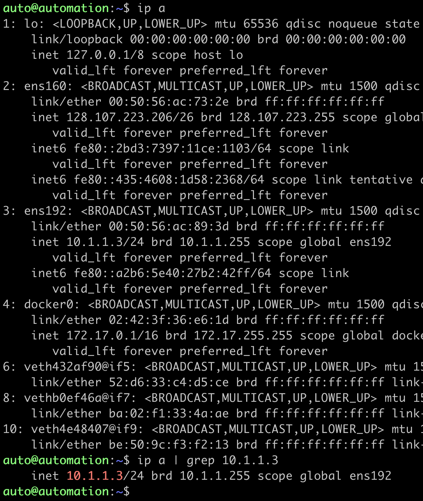
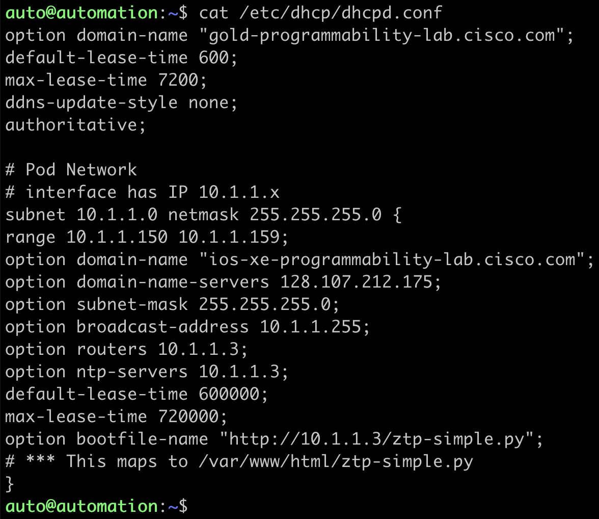

# Module: Zero Touch Provisioning

In this module, you will verify and confirm the prerequisites for Zero Touch Provisioning (ZTP), the feature of IOS XE on the Catalyst 9300 switch. At the end of this module, you will issue the 'write erase' command, reload the switch, and watch as the ZTP process completes and the switch is configured programmatically and automatically.

What is ZTP? When a device that supports Zero-Touch Provisioning boots up, and does not find the startup configuration (during initial installation), the device enters the Zero-Touch Provisioning mode. The device searches for an IP from a DHCP server and bootstraps itself by enabling the Guest Shell. The device then obtains the IP address or URL of an HTTP/TFTP server, and downloads a Python script from an server to configure the device.

# Getting Started


## Step 1:
**ZTP Python File:** Review the `ztp-simple.py` file on the Ubuntu VM which is located at `/var/www/html`. This file uses the Python API to set the interface IP address, configure credentials and enables access to the device over the programmatic interfaces, as well as to configure some additional device features. From the Windows Jump Host desktop, onen a SSH session to the **Ubuntu** server and review the `ztp-simple.py` script:

> **auto@pod28-xelab:~$** cat /var/www/html/ztp-simple.py

**Note** : The Python script within the POD environment will be longer than the abridged version below, but the two will contain similar content

```Python
print "\n\n *** Sample ZTP Day0 Python Script *** \n\n"
# Importing cli module
import cli

print "Configure vlan interface, gateway, aaa, and enable netconf-yang\n\n"
cli.configurep(["int gi1/0/24","no switchport", "ip address 10.1.1.5 255.255.255.0", "no shut", "end"])
cli.configurep(["username admin privilege 15 secret 0 Cisco123"])
cli.configurep(["interface Loopback0", "ip address 192.168.12.1 255.255.255.0", "end"])
cli.configurep(["aaa new-model", "aaa authentication login default local", "end"])
cli.configurep(["aaa authorization exec default local", "aaa session-id common", "end"])
cli.configurep(["ntp server 10.1.1.3", "netconf-yang", "end"])
cli.configurep(["line vty 0 15", "transport input all", "exec-timeout 0 0", "end"])
cli.configurep(["ip scp server enable", "end"])
cli.configurep(["hostname C9300", "end"])
cli.configurep(["telemetry ietf subscription 101","encoding encode-kvgpb","filter xpath /process-cpu-ios-xe-oper:cpu-usage/cpu-utilization/five-seconds","stream yang-push","update-policy periodic 500","receiver ip address 10.1.1.3 57500 protocol grpc-tcp","end"])
cli.configurep(["ip http secure-server", "restconf", "end"])
cli.configurep(["iox", "end"])
print "\n\n *** Executing show ip interface brief  *** \n\n"
cli_command = "sh ip int brief"
cli.executep(cli_command)

print "\n\n *** ZTP Day0 Python Script Execution Complete *** \n\n"
```

## Step 2:
**IP:** The IP address on the Ubuntu VM is is 10.1.1.3 and can be confirmed with the following commands. It is important to know the IP as it is used for setting the DHCP option 67 - this is how the IOS XE devices know where to find the Python file to execute.

Check the interface IP assignments:

> **auto@pod28-xelab:~$** ip a
>
> **auto@pod28-xelab:~$** ip a | grep 10.1.1.3




## Step 3:
**DHCP Server** : ZTP works when the DHCP server replies to the IOS XE device with DHCP option 67 in the DHCP Response. The DHCP server's configuration file is called `dhcpd.conf` and it is located in the `/etc/dhcp/` folder. It specifies the IP range to serve DHCP leases to, as well as the Python file that the device will download and executed as part of the `option bootfile-name` which is also known as `option 67`.

Examine the DHCP server configuration:

>**auto@automation:~$** cat /etc/dhcp/dhcpd.conf



Check the status of the DHCP service to ensure it is running correctly

> **auto@pod28-xelab:~$** sudo /etc/init.d/isc-dhcp-server status


## Step 4:
**Webserver** : NGINX webserver is used to serve the python file that the device learns about from the DHCP options.

Check the status of the NGINX webserver to ensure it is running:

> **auto@pod28-xelab:~$** /etc/init.d/nginx status


## Step 5:
**IOS XE Device:** Now the prerequisites for ZTP are met and the device is ready to be reloaded once the previous configuration is removed – this is to ensure that the Day0 ZTP process is initialized once the switch boots. This emulates a new, un-configured device that is ready to provisioned.

## Conclusion
The Cisco IOS XE Catalyst 9300 switch will  successfully completed the Zero Touch Provisioning process and and be fully configured on the network. Because of the pre-configuration within the ztp-simple.py file, all use cases for the related IOS XE Programmability Lab have been enabled. Specifically, the switch has an IP, username/password, SSH access enabled, and the programmatic NETCONF and RESTCONF interfaces have also been configured and enabled.
