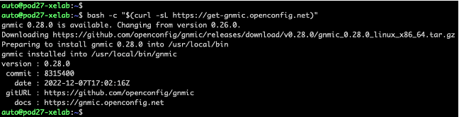
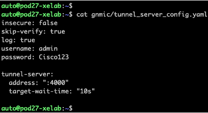
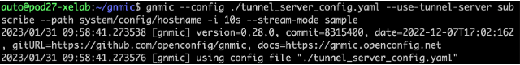
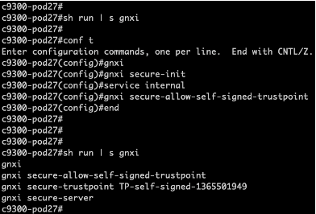
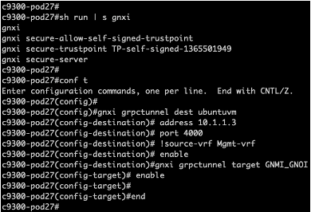

## gRPC Tunnel
Use gRPC Tunnel to make a secure direct connection from one or many devices to the gRPC tunnel server host.

1. Review how to install gnmic tooling - this has already been completed in the lab POD
```
bash -c "$ (curl -sL https://get-gnmic.openconfig.net)"
```


2. Change Directory to the **gnmic** folder by entering command **cd gnmic**  and then review the tunnel_server_config.yaml by running **cat tunnel_server_config.yaml**
```
insecure: false
skip-verify: true
log: true
username: admin
password: put_yours_here

tunnel-server:
  address: ":4000"
  target-wait-time: "10s"
```


3. Enable the gnmic tunnel server
```
gnmic --config ./tunnel_server_config.yaml 
--use-tunnel-server subscribe 
--path system/config/hostname -i 10s 
--stream-mode sample
```


4. Enable gNMI API on IOS XE 17.11+ (Note: this has already been done for you for this lab)
```
gnxi
gnxi secure-init
service internal
gnxi secure-allow-self-signed-trustpoint
```


5. Configure and enable gRPC tunnel
```
gnxi grpctunnel dest ubuntuvm
 address 10.1.1.3
 port 4000
!source-vrf Mgmt-vrf
 enable
gnxi grpctunnel target GNMI_GNOI 
 enable
 ```
 
